# Human Capital

- **Knowledge** & **Experience** possessed by an individual

# Domestic Rates

- It is calculated by (**Rateable Capital Valuation \* Domestic Regional Rate for the area**).
- The domestic rate for your area is made up of the **regional rate** and the **district rate**.

## Rateable Capital Value

- It is the **capital value of your property** on 1st Jan 2005.

## Domestic Regional Rate

- It is the **amount in pounds** of the value of your property that you will **pay for regional services**.

# A+/A1 Domestic Rates

- They signify that bonds are of high-quality and have many **positive qualities**, but do carry a **slightly higher degree of long-term investment risk**.
- Both A+ and A1 fall in the middle of the **investment-grade** category.

## Credit Ratings

- Credit Rating agencies' main aim is **to check the financial condition** of the company **while lending money** to them that will they be able to even pay back or not.
- Credit Ratings determine the **ability of company to repay the loan**, if the **rating is bad** then company **might fail** to return the amount and if its **good** then it means that company have the **ability to return** the amount back.
- **Past credit history** is one of the major factors which affect the credit ratings of the company. It checks the **misinterest payments** or **failure to return** the loan.
- Credit ratings provide a **useful measure** for comparing fixed-income securities, such as bonds, bills, and notes.
- Most companies receive ratings according to their **financial strengths, prospects, and past history**.
- Companies that have manageable levels of debt,** good earnings potential**, and **good debt-paying records** will have good credit ratings.

## Investment Grade Mean

- Investment grade refers to the **quality of a company's credit**.
- The **more the rating**, the **lower the returns** but **safe to invest** as **high chances of return**.
- "AAA" and "AA" (**high credit quality**) , "A" and "BBB" (**medium credit quality**) are considered investment grade and ("BB," "B," "CCC," etc.) are considered low credit quality, and are commonly referred to as "**junk bonds**."

# Ways to raise money

- There are 2 ways : **Loan from Bank** or **Share / Stock Market**.
- Bank **charges interest** and share **takes some part of the company**.
- In share market, they bring issues, means they issue their shares.
- There are types of issues :
  

- Here **Public issues** are **retail investors** (non-professional, individual investor who invests money in their own accounts, typically through traditional or online brokerage firms) ie normal public.
- When company **gets issued** for the **first time** in the market then its called **IPO**.

## QIP (Qualified Institutional Placement)

- Common retail investors cannot invest in it. Qualified institutional buyers (QIBs) are the only entities allowed to purchase QIPs.
- They issue shares without going through standard regulatory compliance.

# Ways to invest money

1. Saving Account : Lowest risk and low return , can take out money whenever we want. 4% return
2. Fixed Deposit (FD) : Very low risk, time restriction , 6-8% return
3. Gold & Jewellery : Moderate Risk
4. Real estate : Means buying house/property. Low-moderate risk. Need large capital
5. Stock Market

# Invest have 3 things

1. Return
2. Risk
3. Time

# Diversification

- Never invest at one place which will split if there is loss in a company.

# Types of Mutual funds

1. Equity MF : Where they invest our money in stocks , where there is high risk and high return.

# Intraday

- Means buying and selling of stocks on the same day.

# CNC (Cash N Carry)

- Means when we want to hold any stock for more than 1 day then we can use this option and here we can hold our shares till any time we want.

# MIS (Margin Intraday Squareoff)

- Means here we have to square off our position in one day.

# SL (Stop Lose)

- Means trader can set the lose amount and if the amount goes below it then it will automatically be sold by the app.

# SLM (StopLose Market)

- Here we can set the trigger price means we can mention aisa amount jiske aas paas agar share aya toh vo sell hojayega.
- Can be used as profit detection as well like agar 100 ka purchased agar 200 pe aya toh just sell it.

# BO (Bracket Order)

- Here we can set the range of the lowest and highest price jiske exceed hone par it will be sold automatically.

# CO (Cover Order)

- It means you are investing covering your losses.
- Here we have to put stoplose compulsorily because it gives more leverage (profits made to be greater than the interest payable) means less margin se zyada amt ka trade .
- Stoplose 1.5% se zyada nhi hona chahiye compared to the amount you have invested.

# EBITA

- It stands for **Earnings Before Interest, Taxes, Depreciation, and Amortisation**.
- Can also be written as Net Profit + Interest, Taxes, Depreciation, and Amortisation.
- Earnings are profits.
- Interest means if any loans are taken then its interest is considered.
- Taxes based on money we make.
- Depreciation means value of company's assessts keep decreasing, which is it.
- Amortisation means value of company's intangible assessts keep decreasing, which is it.
- It is the deciding factor that will the company be able to return the debt or not.
- Helps to judge fair purchase price.

## Intangible Assets

- Intangible asset that is not physical in nature.
- These are patents, trademarks, and copyrights which are not present physically but owner would earn money if other people likes to use it.

# Net Profit

- It is Total Income - Total Expenses.

## Total Income

- Income through Products or services and other ways of earnings.

## Total Expenses

- It includes Fixed Expenses (Rent, Advertising Insurance) , Variable Expenses (Raw material expenses , labour expenses , etc) , Taxes , Interests, Depreciation and Amortisation.

# FNO (Future and Options)

- There are 2 options : Call option and put option
- In Call option, we get the right to buy from the option seller.
- In put option, we get the right to sell it to option seller.

## Strike Price

- This is the price we've confirmed to do trading.

## Premium

- It is also called price like the normal price we would have to pay.
- It is the insurance price.

# Speculators

- They take risk to get returns.

# Hedger

- They cant bare the risk, so they just accepts the offer with some fixed rate which they will give no matter the market price at that time.

# Arbitrage

- They buy a share with lower price from one place and sell it to other with higher rate.

# Share Market Course

## 72 Rule

- 72 rules says that if you divide the yearly interest with 72, it will give out total years it will take to double your amt.

## Fundamental Analysis

- **Value VS Price**: Value means what value is the product giving, matlab uska worth kya hai. Price means uska price kitna hai.
- **Value investing**: Means stock jo bhi buy kiya vo uske (intrinsic value se) kam price mai buy kiya. Means if price 100 hai but value sirf 80 dera hai, toh intrinsic value se zyada pay krdiya, means 20 ka loss.
- We will learn how to check if the price is lesser than the Intrinsic value or not.

## Ratios

1. PE (Price to Earning) Ratio

- Means kitna hum pay krenge aur return kitna milega.
- Means price agar 1000 ka hai, and earning 100 ka hai, toh uska PE Ratio is 10. Matlab to earn 1 rupee, you will pay 10 rupees to the company.
- Jitna kam hoga utna achha.

2. PB Ratio (Price to Book)

- Agar price is 100, and book value bhi 100 toh uska PB ratio 1 hai which is good. PB ratio 1,2 are good.
- If zyada PB ratio hua then it means ki price zyada hai par book value (current value) kam hai.
- Jitna kam hoga utna achha.

3. Debt to Equity Ratio

- Debt zyada sasta hota hai compared to equity for any company agar repay kar skte hai toh. Startups ko koi jaldi se debt nhi deta.
- Debt to equity ratio agar 2 hua toh means usne 2x debt liya hai compared to equity.

4. Cuurrent Ratio

- Current Assets / Current Liabilities => Current Assets mai jisse turant we could earn, Current Liability means jo money company ko turant dena hai kisiko.
- If assets is 20 Cr and if liability is 10 Cr, means current ratio is 2 which is good.
- Jitna zyada utna achha, because company k paas zyada money hai, but kisi ko dena nhi hai zyada in manufacture or loan or whatever expenses k reason se.

## Ratio Analysis and 100% Fundamental

- **PE** ratio agar **negative** hua (Price/Earning) means **company ka earning** is **negative** because **price** would **never be negative**.
- **PB** ratio would never be **negative**.
- 90% analysis is done after seeing this **ratio and intrinsic value**.
- 10% mai check unka **business, monopoly, future need and competitors**.
- Monopoly business check kro, if there is a sector where there are no other other company. Eg: IRCTC (railway)
- Check **competitor**, and if **there is a competitor**, check and **compare market capital, sales and cash flow among these companies**.

## Dividend yield

- Many companies **give the dividend** and **many don't**. If they don't, then they **use it to invest in other shares** jisse they **increase** their **share value**.
- The reason why some companies doesn't give dividend, is that they invest in other companies from their side thinking ki if people would know what is the good place to invest, then why would they invest in our company.

## Total values

- Check if **total revenue is increasing** year by year. Must **increase** in 3 years atleast.
- Same with **assets and liabilities**, assets must be **greater** and liability must be **lesser**.

## Pledge and Promotor

- **Promotor** means the **one who owns the company**, uske paas **kitna shares hai**.
- **Pledging** means **selling their stocks**, and people sell stocks when they feel that it **would not make any profits**.
- **Increased Total Promotor** agar green hai, means company is **buying their own shares**, they do this when they see good future in their company.
- **Low pledged promoter** holding is green, means **pledging happening is less**, which is good.

## Share holding history

- If **foreign institute** have invested means its a **good share**.
- If foreign institutes are **increasing the holdings** year by year, then its a **good sign** because they invest in bulk at good firms only.
- Promotor holdings **agar kam nhi hore over 3 years toh its good**.

## SIP (Systemmatic Investing Plan)

- Every bank have different % interest which they give in return on our investment.
- We must understand compounding, means increase/doubling in money after few years.

## US Stock and Indian Stocks

- India have 2 Index :- NSE and BSE.
- NSE is **National Stock Exchange** which contains top 50 companies, also called **Nifty**.
- BSE is **Bombay Stock Exchange** which consists of top 30 companies, called **Sensex**.
- There are more than 4000 companies, but we could determine if the **stock market is up or down depending on these companies**.
- US Stock has **Nasdaq** and one advantage is that **Dollar is getting increased in value** with respect to INR.

## Mutual Funds

### How Mutual Fund works

- Mutual Funds are run by **AMC (Asset Management Company)**.
- AMC take around **1-2% **from the **invested amount** and give **returns to the customer**, and it is run by a **knowledgeable manager with a team**.
- **IPO(Initial Public Offering)** is done when there is a **new company** jinko apna stock list krwana hai, in case of **Mutual fund** there is **NFO (New Fund Offering)**

* Mutual Fund companies gives us NAV
* They also earn through **Exit Load** which is put when we exit the MF before time. Its percent is **0-4%**

- People will suggest to invest in NFO, which according to him is senseless because NFO is new MF which will invest in many other companies, which will take time in growth, there are many good mutual funds out there which we good look upto.

### Analyses

- It is **AUM** which is **Asset Under Management** means how much are they holding the shares.
- **CAGR JY** says ki how much return % did they give over the years.
- **Expense Ratio** if 1 se upar then its **good**, below 1 is also good.
- If **Time horizan is 3-5 yrs**, then choose **Mid Cap**, and if **5 yrs+** then go for **Flexi Cap funds(recommanded) **or any from Small Cap, Multi Cap or Flexi Cap.
- Reason to invest in **Flexi Cap** is that if there is a company which **they feel that in 5 years it could come in top 50**, then vo log will **invest in it**.
- **Dont go for Large Cap** because you can choose **Index itself** (Nifty 50 or Sensex). Why to give fees for the same thing.
- Check Flexi Cap ke good/top Funds on tickertape.

### Types

1. Debt

- Slighly safer than equity because equity investment is directly in stocks and stocks could change anytime. Less risk and less returns.

* It depends on Time horizon means the amount of time you are going to keep the investment.

2. Equity

- There are few caps like **Large Cap, Mid Cap, Small Cap, Multi Cap, Flexi Cap** companies
- Large Cap companies mai **low risk** and **low returns** hote and mutual fund go for these companies.
- Mid Cap companies mai **mid risk **and **higher returns** than Large Cap.
- Small Cap mai **high risk** and **high returns**.
- Multi Cap **teeno mai invest krti**, and they have to **keep a track** of their investments.
- Flexi Cap invest in **any Caps** depending on their companies ka performance, and unko **reason nhi dena hota**.

3. Hybrid

- Don't need to invest isme

### ETF Investment

- Mutual Funds are handled by AMC and these ETFs are Exchange Per Trade. Exchange Per Trades are NSE and BSE. Just like stock investing but more like mutual funds.
- These are funds and not stocks.
- ETF ka one example is Nifty Bees (BenchMark Exchange Trading Scheme) which we can buy. Nifty Bees is an ETF for Nifty 50. ETF will go up when Nifty goes up.
- ETF will never fail or go 0 because your money is getting invested in multiple companies like in case of Nifty it is invested in 50 companies. One stock can be 0 but not all.

- Advantages:

1. Diversificaion Benefit: Means many companies mai invest hota hai.
2. Professional Management: Professionals hee manage kr rhe.
3. Low Cost: Cost bohot low hota compared to MF.

- You can also invest in US stocks from IND Money.

- Advantages for US Stocks:

1. Fractional Investing: means you can invest minimum value bhi in US Stocks.
2. Dollar Appreciation: INR ki value is depreciating in terms of Dollar.
3. Portfolio Diversification: Means aur diverse companies mai invest kiya.

### ETF Strategy

- **Dont use this strategy in stocks or mutual funds, use this only for ETF because stock could go 0.**
- Check if Nifty or Sensex is up or down for the day.
- Take atleast 10% from your salary and start investing.
- Market is closed on weekends so 20 days a month, therefore divide the invested amount by 20 and invest in ETF whenever the market is down.
- If amount is 5000, divide 5k with 20 and invest on days when market is down so when market goes up, you will generate profits.
- It will growth anyways and failing chance is almost 0 because ETF is like you are investing in so many companies.

## Technical Analysis

### Types of Tradings

- There is Trend Trading, Reversal Trend Trading and breakout-breakdown trend.

### Support and Resistant lines

- Resistance is the drawn line jiske upar stocks jaa nhi rha and Support line is the line jiske neche stocks nhi ja rha.
- Resistant means where sellers are ready to sell and support means jaha buyers are buying.
- There are level of resistances, if resistance breaks 1 level, there would be another level sitting higher from it like R1, R2, R3, etc.
- When it starts crashing then it could reach its support, or even lower than that like S1, S2, S3, etc.
- When it starts crashing, means sellers are selling at any cost by which value girr rhi hai.
- Many people leave jab unka resistence level (amount of profit) is reached, some of wait to make more out of it.

### Pivot Points

- You can use Indicator called Pivot Point Standard which will make all the pivots ie the support and resistant lines.
- You can say your profit and loss based on it and can put stop loss based on that.
- You can also manually plot the lines by observing the candles.
- If one Support breaks, then it will go aur lower to its previous support, else will go upper to its next pivot ie next resistence.
- Stop loss supports and resistence k basis par you can take.

### Trend Trading

- Never go against the trend.
- Types of Trend tradings are:

1. Up trend:

- Stocks going up in a trend.

2. Down trend: Stocks going Down.
3. Sideways trend: Stocks going sideways, ie, no increase, no decrease.

- How to determine that a trend is powerful or not (means agar up trend hua toh will it be up for more time or for few time), use ADX(Average Derivative Index) indicator.
- ADX will show that if the trend have the power to continue the trend or not. Agar ADX goes below 25, it means jaan nhi bachi.

### Indicators (Important)

- We can get the lines automatically using SuperTrend from indicator.

### IMPORTANT TIP

- Bhaagte ghodhe ko chane khilaao.
- Never put money in down trend, when you see trend going up, start putting money.
- If you go against trend, you will lose.

## Price Action

### Buyers Vs Sellers

- Buyers and sellers are always in competition with each other. If buyers are more strong, then stocks will go up, else it will go down if sellers are powerfull.

### Master Price Actions

- To master this, you must understand these 4 points:

1. Trends
2. Support and Resistance
3. Candle sticks patterns
4. Chart Patterns

### Candle sticks patterns

- It is important because in shares, history repeats, and jo pattern bann chuke, wahi repeat hote.

### Autotrender software

- PCR - Put Call Ratio. If 1 se upar then market upar jaane k chances
- 1 se neche matlab girne k chances.

### How to predict when to do trend trading

- 1st way: Global market and PCR dekh kr u can decide ki trend trading krni h ya nhi
- If global market profit mai hai and PCR 1 se upar hai, means market mai bullish run hoga, means market badh skti hai.
- 2nd way: Price action observation

### Volume importance in price action

- When you notice a certain trend, lets say up or down, always notice how much volume does it has.
- You could see volume in futures trade section.
- This will let us know that does the trend have the capacity for long jump or its just for short period.

### Marking Zone

- We can always mark the zones depending on the changing point of the candles.
- Agar zyada price ek hee zone par hai, matlab waha log bethe hai sell aur buy krne k liye.
- You must also mark pivot, support and resistences while trading jisse you can predict ki market will go up or down.

### Breakout and Breakdown

- Ye trading krne k liye you must understand volume, support and resistence.
- Ek baar market ne support ko break kiya, matlab vo neche jaayega till its pivot in most of the cases. Toh once support ka line break hua, people start buying for breakdown, means jitna neche jaayega market utna profit.
- In such cases, keep trailing your stop losses, matlab harr candles ka high ko ek stop loss bana do.
- Always respect your stop loss.
- Price retest bhi krta hai, means when candle breaks the support line, people start taking entries and stocks again goes above the support line. Dont panic in such cases, because tumne money lagaya tha down mai and stocks upar gaya, so in such cases, stop loss laga diya karo to the support line. When retest hogya, means support k niche chalu hua jaana toh fir firse entry lelo.

## Top Indicators for Intraday

### Time Frame check

- Check 5 mins time frame and then 15 for better accuracy.

### SuperTrend

- Supertrend is good when market goes in one direction, and is not good to use when market is sideways.

### MACD (Moving Average Convergence Divergenece)

- There are blue and red lines.
- When blue line cuts red line from down, then its a signal to buy and when blue line cuts red from top, then its selling ka signal.

### VWAP (Volume Weighted Average Price)

- Market iske blue line k aas paas hee ghumta hai.
- VWAP se durr jaa skta hai, but it will try to reach it again.

### ADX

- It shows how energetic the trend is. It doesn't show increase or decrease.

### PCR

## Candlestick chart patterns

- Volume is important for getting high accuracy in candle stick patterns.
- Candle mai body hoti hai and upper shadow or lower shadow hoti hai, jinko we could also call wick.
- Candle says 4 things: Open, Close, High and Low.
  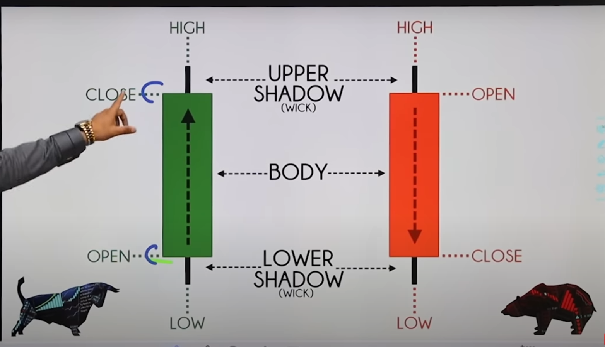

## Pin Patterns

### Single Candlestick patterns

> **Small Body big Shadow (Atleast 2x the body size)**

- Zyada time frame gives more accuracy.

#### 1. **Hammer and Hanging man**

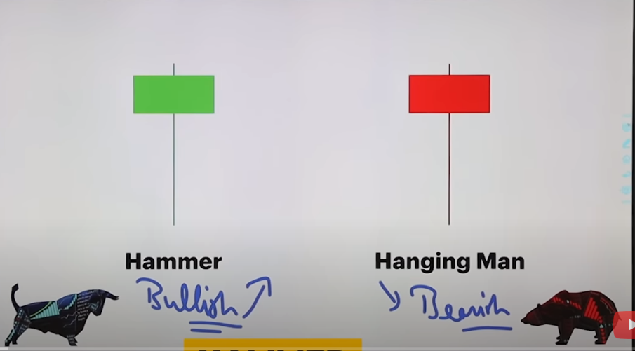

- The **size of shadow** must atleast be **double than** the **size of the block**.
- Agar this pattern is at the bottom, it means it's a hammer and stock will go up, and if this is at the top, means it's a Hanging Man pattern.
- Color doesnt matter, its position indicates ki which pattern is it.
- In case of Hammer, it indicates that buyers are very strong. Volume must also increase in this case. It works very good when Volume is good.
- **STOP LOSS and TRAILING**: In this pattern, keep your stop loss as the **pin ka high** and keep shifting your stop loss jab tak its making profit.

- **Hammer Example**
  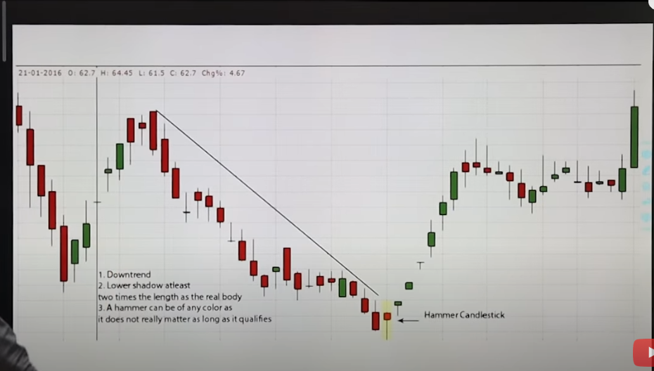

* Isme you can see that while coming down, there is a pin at the top, before that drawn line and while going up, there is a pin at bottom marked as Hammer.
* Isse indicate kr skte hai ki market upar jayega ya neche.
* **Hanging man example**
  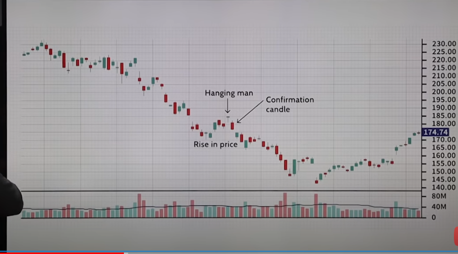
* In this example, see that the hanging man has green color, so color doesn't matter and volume bhi maintained hai, so market mai dum hai.

#### 2. **Inverted Hammer and Shooting Star**

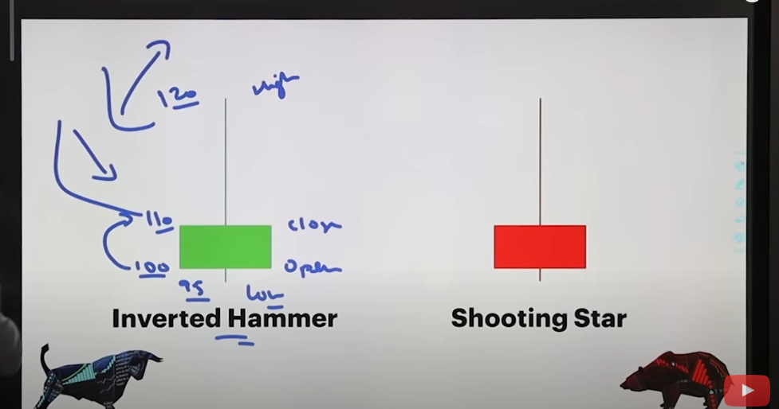

- **Inverted Hammer example**
  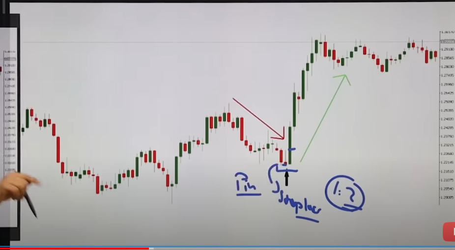
- In the above example, stoploss jaha likha hai that is **Inverted Hammer candle**.
- Confirmation check karo by seeing its **high shadow**, jab cross hua, then you must **start investing**.
- Stop loss **Invested Hammer k bottom wick** par laga le.

- **Shooting Star**
  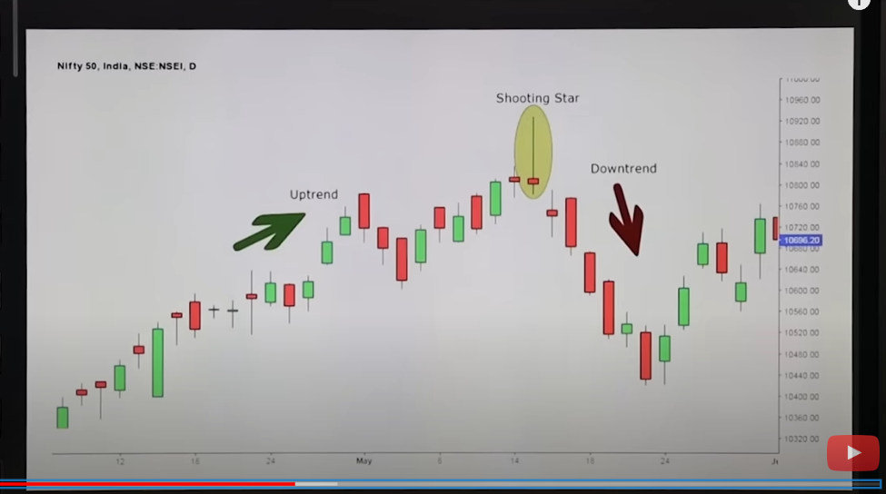
- Confirmation mila by seeing the candle for below the bottom wick.
- Stop loss uske high wick par rakho.

### Dragonfly Doji and GraveStone Doji

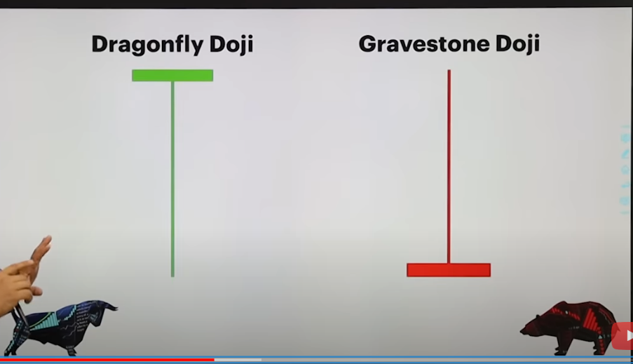

- **DragonFly Doji Example**
  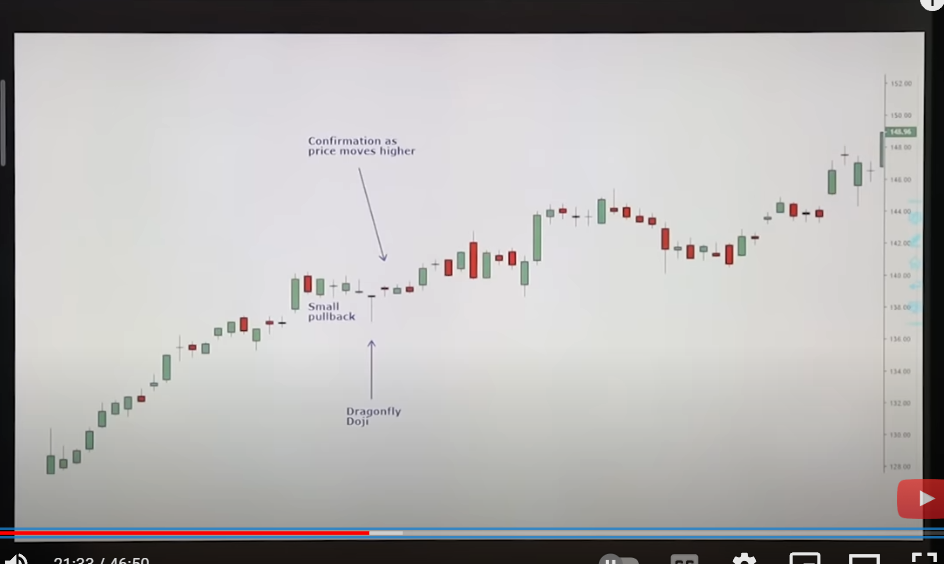
- **Another example of DragonFly Doji**
  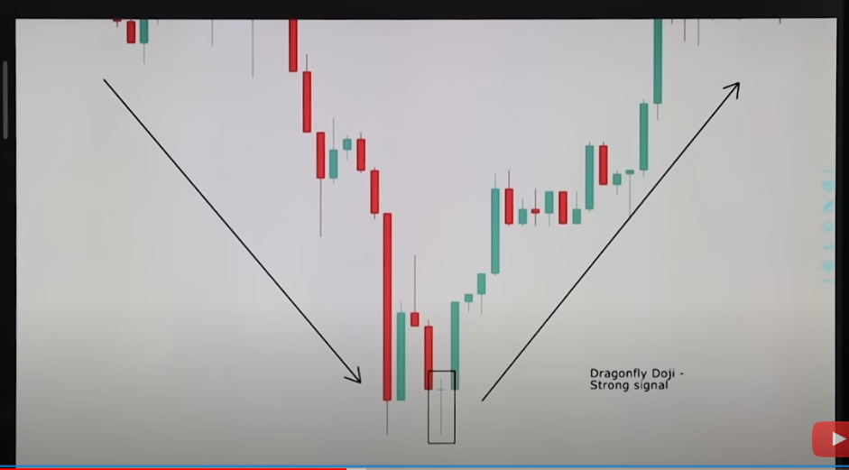
- **GraveStone Doji Example**
  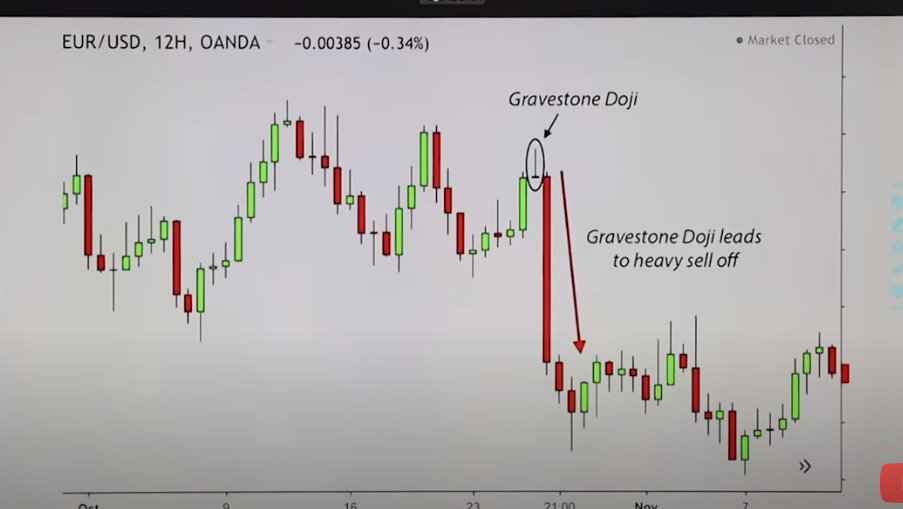

### Double Candlestick Patterns/ 2 Candlestick Patterns

#### 1. Bullish Engulfing and Bearish Engulfing Pattern (Most important)

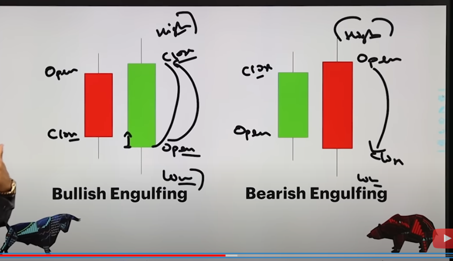

- Here ek candle eats other candle.
- Bullish Engulfing is the best when it is at the bottom.
- Bearish Engulfing is the best when it is at the top.
- Bullish Engulfing is a signal that price will rise and Bearish Engulfing is a signal that price will crash.

EXAMPLE
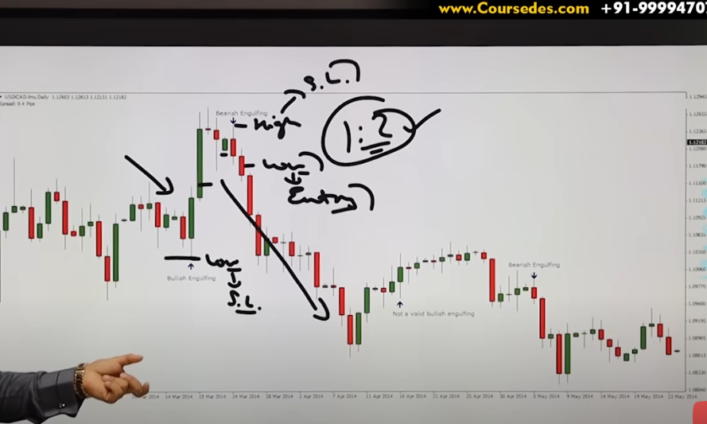

- Very good example where you can see both bullish and bearish engulfing.
- First Bullish hua, confirmation is done when the bigger candle crosses the smaller candle ka top wick, and stop loss bigger candle k bottom par laga doh.
- Then aage jaakr, Bearish hua, green candle ko red candle khaa gaya, this is an indicator to leave the trade and reinvest for the opposite direction.

### Bullish Harami and Bearish Harami

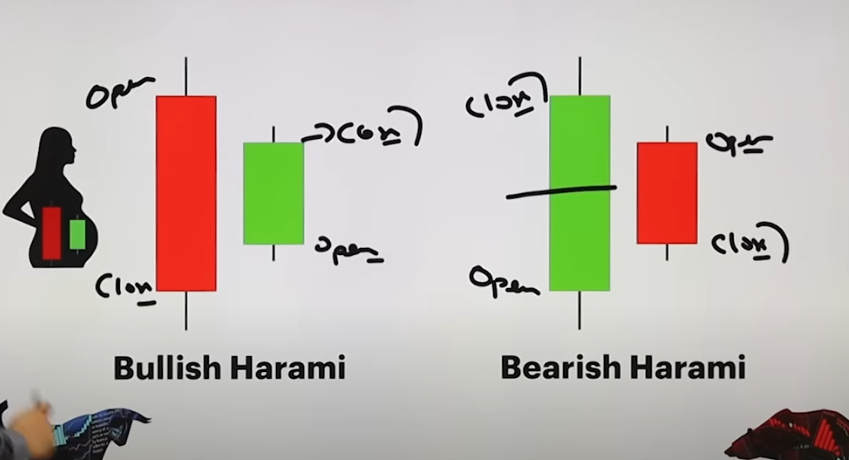

- Here one candle is at the middle of the other and halfway through.
- Like in bullish harami, green's top is above the red ka mid and the candle is in the middle.
- Confirmation for bullish harami is by checking the green candle ka upper wick. If next candle crosses the green candle ka upper wick, it means you can start investing and stop loss will be its lower wick.
- Bearish harami mai if red candle ka lower wick is crossed by the next candle, you can invest and stop loss upper wick ko laga skte.

* **Bullish Harami Example**
  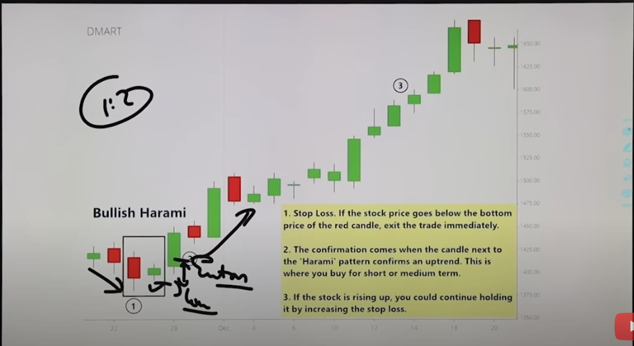

* **Bearish Harami Example**
  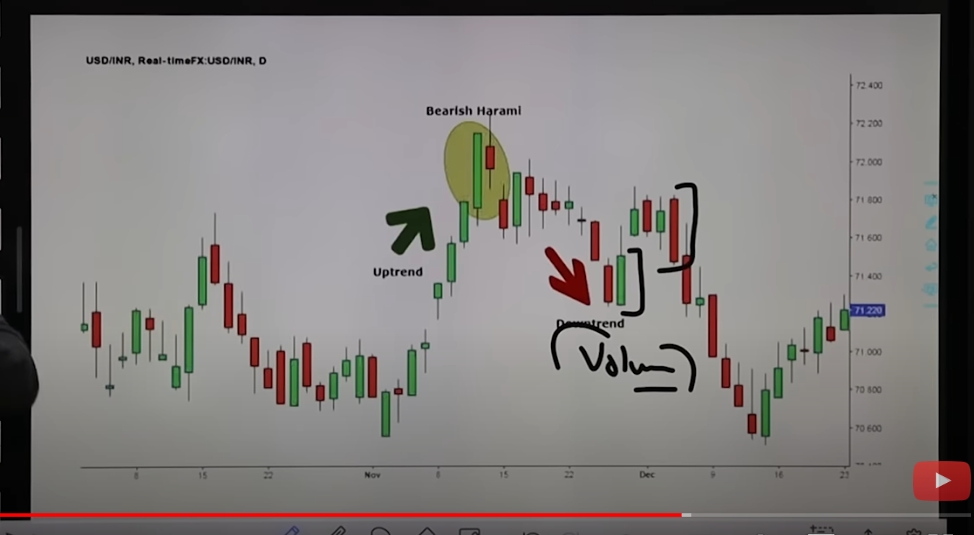
* In this example, Bearish Harami is formed, and we confirm it when we see the next red candle crossing the bearish harami's red candle ka lower wick. Stop loss must be set to the Bearish Harami's red candle ka upper wick.
* Aage there is Bullish Engulfing, and uske aage there is Bearish Engulfing, so you have to keep checking which patterns are getting generated.

### Triple CandleStick Patterns

#### 1. Morning and Evening Stars

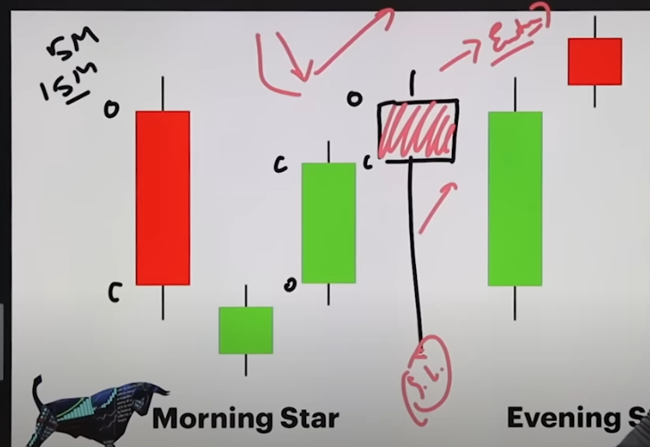
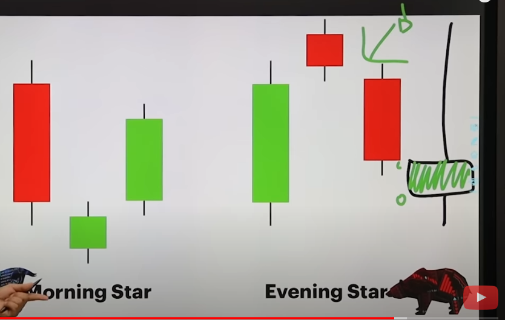

- Triple CandleStick itna important nhi hai because you will see **triple candlestick pattern in 5 minutes** and same thing will look as single candlestick ka **pin pattern in 15 Minutes**.
- In morning star, 1 stick mai dekhna hai toh opening and closing dekho (red and green ka), and draw a square, then highest and lowest par make wick. This will give **Pin Pattern (Hanging man)**.
- Similarly in Evening star, Opening and closing dekho within the 3 bars and plot a square. With that make a wick, this will give **Inverted Hammer**

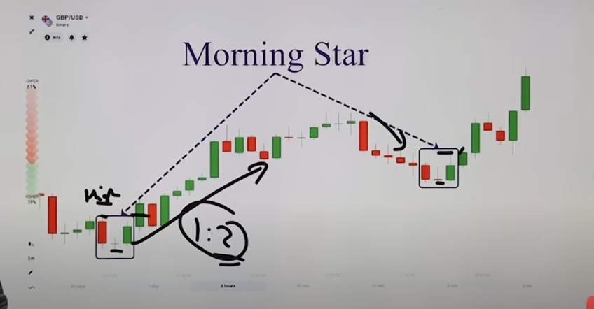

- Confirmation is done when you see further candles breaking the top wick of the morning star. Set your stop loss as its bottom wick. Then keep trailing.

* Aage again there is a Morning star, then you can set uss ka bottom wick as stop loss.

#### 2. Bullish and Bearish Abandoned Baby

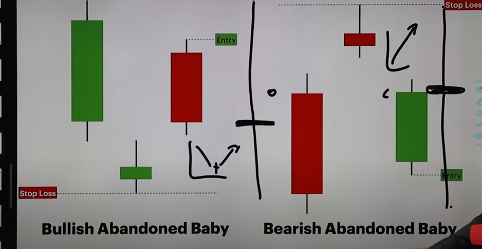

- In 15 mins frame, it is like Doji.
- Doji because level of both the candles within 3 sticks is same.
- Check where is doji, like is it at the top or at the bottom.

- **Bullish abandoned baby ka example**.
  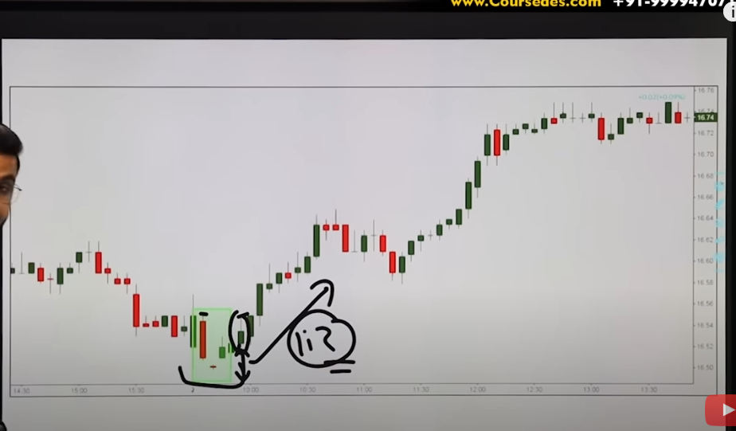

- Its confirmation is when the high of red is broken by further candles which is done after 2-3 candles in this example and set the stop loss as the entry candle ka bottom, and then keep trailing for bigger profits.

* **Bearish Abandoned Baby ka example**
  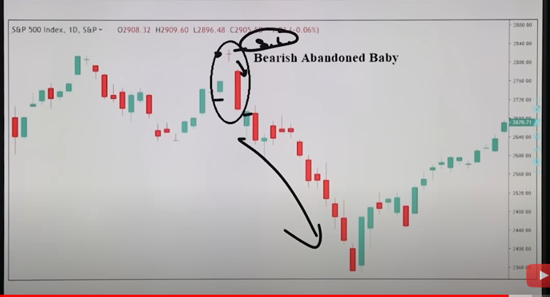

- Confirmation is when the green ka bottom of bearish abandoned candles is crossed by further candles and set stop loss as top wick of red candle.
